# PPT Generator Service - Architecture

This document provides a comprehensive view of the PPT Generator Service architecture, including all components, data flows, and inter-service dependencies.

## Table of Contents

1. [High-Level Architecture](#1-high-level-architecture)
2. [Staged Deployment Architecture](#2-staged-deployment-architecture)
3. [V3 Simplified Workflow Pipeline](#3-v3-simplified-workflow-pipeline)
4. [Request Lifecycle](#4-request-lifecycle)
5. [Azure Services Infrastructure](#5-azure-services-infrastructure)
6. [Data Storage Architecture](#6-data-storage-architecture)
7. [Template Metadata Flow](#7-template-metadata-flow)
8. [Service Dependencies](#8-service-dependencies)
9. [Scaling & Autoscaling](#9-scaling--autoscaling)
10. [Error Handling & Retry Logic](#10-error-handling--retry-logic)
11. [Security Architecture](#11-security-architecture)

---

## 1. High-Level Architecture

### Overview

The PPT Generator Service is a serverless, AI-powered presentation generation system built on Azure. It transforms structured data collections into professional PowerPoint presentations using a simplified V3 architecture with Azure OpenAI's Assistants API, orchestrated by Azure Container Apps.

### Design Philosophy

**Core Principle: LLM-Driven Intelligence with Local Rendering Control**

The V3 architecture consolidates presentation design intelligence into a single Azure OpenAI Assistants API call while maintaining local control over chart rendering quality. This approach provides:

- **Simplified Orchestration**: Single API call replaces complex multi-node pipelines
- **AI-Driven Design**: Assistants API handles data analysis, narrative design, and visualization selection
- **Local Rendering Control**: ChartRenderer processes JSON blueprints with Plotly for consistent quality
- **Quality Over Cost**: GPT-4o provides executive-level presentation quality

**What the Assistant Does:**
- Analyzes all data collections comprehensively
- Designs the narrative arc and slide structure
- Selects optimal chart types for each dataset
- Returns structured JSON with chart blueprints (not images)

**What the Orchestrator Does:**
- Parses chart blueprints from Assistant response
- Renders charts locally using Plotly + Kaleido
- Assembles PowerPoint with high-quality chart images
- Manages state, storage, and delivery

### Key Design Decisions

| Decision | Choice | Rationale |
|----------|--------|-----------|
| **Processing Model** | Async queue-based | Decouples API from long-running AI processing, allows horizontal scaling |
| **AI Orchestration** | Azure OpenAI Assistants API | Single-call AI generation with structured outputs, eliminates multi-node complexity |
| **Chart Generation** | AI blueprints + Local Plotly rendering | Combines AI intelligence with deterministic, high-quality rendering |
| **Compute for API** | Azure Functions (Elastic Premium EP1) | Always-warm instances, VNet integration capable, managed identity support |
| **Compute for Processing** | Container Apps | KEDA-based queue scaling, supports custom Python environment with native libraries |
| **State Management** | Cosmos DB (Serverless) | NoSQL flexibility for job state, built-in TTL for auto-cleanup, pay-per-request |
| **Messaging** | Service Bus (Premium) | Guaranteed delivery, dead-letter queues, supports managed identity |
| **Authentication** | Managed Identity only | Microsoft internal requirement - no connection strings or access keys |
| **Deployment** | 6-stage Bicep modules | Isolated resource groups per stage for easier debugging and rollback |

### Deployment Model

The service uses a **staged deployment architecture** with 6 independent stages, each in its own resource group. This provides:
- **Isolation**: Failed stages can be deleted and redeployed without affecting others
- **Flexibility**: AI resources deployed to regions with model availability
- **Clarity**: Clear separation of concerns (foundation, data, compute, functions, AI, web)

See [Section 2: Staged Deployment Architecture](#2-staged-deployment-architecture) for details.

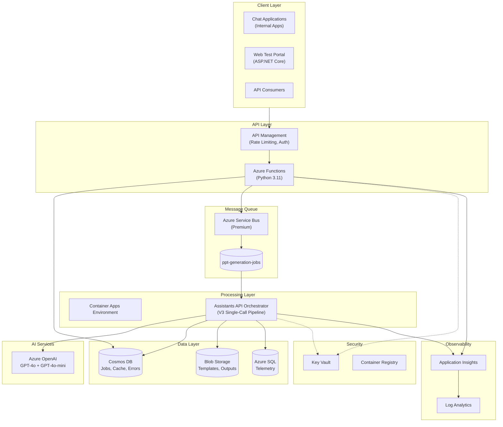

---

## 2. Staged Deployment Architecture

The infrastructure is deployed in **6 stages**, each in its own resource group for isolation, flexibility, and ease of troubleshooting.

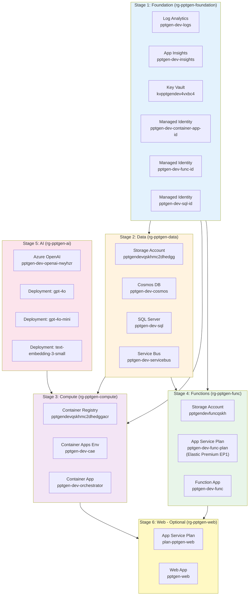

### Stage Details

| Stage | Resource Group | Location | Purpose | Resources |
|-------|---------------|----------|---------|-----------|
| **1 - Foundation** | `rg-pptgen-foundation` | eastus2 | Monitoring, identity, secrets | Log Analytics, App Insights, Key Vault, 3x Managed Identities |
| **2 - Data** | `rg-pptgen-data` | eastus2 | Data persistence & messaging | Storage Account, Cosmos DB, SQL Server, Service Bus |
| **3 - Compute** | `rg-pptgen-compute` | eastus2 | Container orchestration | Container Registry, Container Apps Environment, Orchestrator App |
| **4 - Functions** | `rg-pptgen-func` | eastus | API layer | Storage Account, App Service Plan (EP1), Function App |
| **5 - AI** | `rg-pptgen-ai` | eastus2 | AI models | Azure OpenAI, 3x Model Deployments |
| **6 - Web (Optional)** | `rg-pptgen-web` | eastus | Test portal | App Service Plan (B1), Web App |

### Resource Summary from AZURE_CONFIG.json

The following resources are deployed and tracked in `AZURE_CONFIG.json`:

| Resource Type | Resource Name | SKU/Tier | Location | Configuration Notes |
|---------------|---------------|----------|----------|---------------------|
| Log Analytics Workspace | `pptgen-dev-logs` | PerGB2018 | eastus2 | 30-day retention |
| Application Insights | `pptgen-dev-insights` | Workspace-based | eastus2 | Linked to Log Analytics |
| Key Vault | `kvpptgendev4vxbc4` | Standard | eastus2 | RBAC-based, soft-delete enabled |
| User-Assigned Identity | `pptgen-dev-container-app-id` | N/A | eastus2 | Container App principal |
| User-Assigned Identity | `pptgen-dev-func-id` | N/A | eastus2 | Function App principal |
| User-Assigned Identity | `pptgen-dev-sql-id` | N/A | eastus2 | SQL Server Entra admin |
| Storage Account | `pptgendevqskhmc2dhedgg` | Standard_LRS | eastus2 | Shared key access disabled |
| Cosmos DB Account | `pptgen-dev-cosmos` | Serverless | eastus2 | Session consistency, 4 containers |
| SQL Server | `pptgen-dev-sql` | N/A | eastus2 | Entra-only auth |
| SQL Database | `telemetry` | Basic (5 DTU) | eastus2 | 2GB, 5 tables |
| Service Bus Namespace | `pptgen-dev-servicebus` | Premium (1 MU) | eastus2 | 1 queue, managed identity auth |
| Container Registry | `pptgendevqskhmc2dhedggacr` | Basic | eastus2 | Admin user disabled |
| Container Apps Environment | `pptgen-dev-cae` | Consumption | eastus2 | Linked to Log Analytics |
| Container App | `pptgen-dev-orchestrator` | 1.0 CPU, 2.0 GB | eastus2 | Min 1, Max 100 replicas |
| Storage Account (Functions) | `pptgendevfuncqskh` | Standard_LRS | eastus | Function runtime storage |
| App Service Plan | `pptgen-dev-func-plan` | Elastic Premium EP1 | eastus | Linux, Python 3.11 |
| Function App | `pptgen-dev-func` | Python 3.11 | eastus | System + User-assigned MI |
| Azure OpenAI Account | `pptgen-dev-openai-nwyhzr` | S0 (Standard) | eastus2 | 3 model deployments |

### Deployment Sequence

The stages must be deployed in this order due to dependencies:

```
Stage 1 (Foundation) → Creates managed identities and monitoring
    ↓
Stage 2 (Data) → Uses MI from Stage 1 for SQL admin
    ↓
Stage 5 (AI) → Independent, but deployed early for config availability
    ↓
Stage 3 (Compute) → Uses config from Stages 1, 2, 5
    ↓
Stage 4 (Functions) → Uses config from Stages 1, 2, 3
    ↓
Stage 6 (Web - Optional) → Uses config from Stages 3, 4
```

**Command:**
```bash
# Deploy all core stages (1-5)
./infrastructure/deploy.sh -g rg-pptgen -e dev -l eastus2 -s all --openai-location eastus2

# Or deploy individually for debugging
./infrastructure/deploy.sh -g rg-pptgen -e dev -l eastus2 -s 1
./infrastructure/deploy.sh -g rg-pptgen -e dev -l eastus2 -s 2
./infrastructure/deploy.sh -g rg-pptgen -e dev -s 5 --openai-location eastus2
./infrastructure/deploy.sh -g rg-pptgen -e dev -l eastus2 -s 3
./infrastructure/deploy.sh -g rg-pptgen -e dev -s 4 --func-location eastus
```

---

## 3. V3 Simplified Workflow Pipeline

The orchestrator processes presentations through a simplified 5-step pipeline using Azure OpenAI's Assistants API:

```mermaid
flowchart LR
    START([Job Message<br/>from Queue])

    subgraph Step1["Step 1: Receive Job"]
        RECEIVE["Retrieve from<br/>Service Bus Queue"]
    end

    subgraph Step2["Step 2: AI Generation"]
        ASSISTANT["Single Assistants API Call<br/>Returns slides + chart blueprints"]
    end

    subgraph Step3["Step 3: Chart Rendering"]
        RENDER["ChartRenderer<br/>Processes JSON blueprints<br/>using Plotly"]
    end

    subgraph Step4["Step 4: PPT Assembly"]
        BUILD["PPT Assembler<br/>Creates PowerPoint file"]
    end

    subgraph Step5["Step 5: Upload & Complete"]
        UPLOAD["Upload to Blob Storage<br/>Update job status"]
    end

    COMPLETE([Job Complete])

    START --> RECEIVE
    RECEIVE --> ASSISTANT
    ASSISTANT --> RENDER
    RENDER --> BUILD
    BUILD --> UPLOAD
    UPLOAD --> COMPLETE

    style RECEIVE fill:#e3f2fd
    style ASSISTANT fill:#f3e5f5
    style RENDER fill:#fff3e0
    style BUILD fill:#e8f5e9
    style UPLOAD fill:#fce4ec
    style COMPLETE fill:#c8e6c9
```

### Step Details

| Step | Component | Purpose | Technology | Key Outputs |
|------|-----------|---------|------------|-------------|
| 1. Receive Job | Service Bus Consumer | Retrieve job from queue | Azure Service Bus SDK | job_data, request_context |
| 2. AI Generation | Assistants API Client | Single call to analyze data, select visualizations, generate content | Azure OpenAI Assistants API | slides (JSON), chart_blueprints (JSON) |
| 3. Chart Rendering | ChartRenderer | Process JSON blueprints, render charts locally | Plotly + Kaleido | chart_images (PNG files) |
| 4. PPT Assembly | PPT Assembler | Create PowerPoint file from slide specs and chart images | python-pptx | presentation.pptx |
| 5. Upload & Complete | Blob Storage + Cosmos DB | Upload PPTX, update job status | Azure SDK | download_url, job_status: completed |

### AI-Driven Visualization Selection (Blueprint Approach)

The **Assistants API** uses an embedded prescriptive mapping in the system prompt to select optimal chart types and return them as JSON blueprints. The AI:

1. **Analyzes data structure** - Understands metrics, dimensions, and patterns
2. **Matches patterns to chart types** - Uses the prescriptive mapping embedded in the system prompt
3. **Generates chart blueprints** - Returns complete JSON specifications (not images)
4. **Adapts to context** - Considers audience, presentation style, and data volume

The **ChartRenderer** then processes these blueprints locally:

1. **Parses JSON specifications** - Extracts chart type, data, styling preferences
2. **Renders using Plotly** - Full control over visualization quality and styling
3. **Exports to PNG** - Uses Kaleido for high-quality image export
4. **Handles errors gracefully** - Provides fallback visualizations if rendering fails

### Supported Data Types

The pipeline recognizes and handles these data patterns:

| Data Type | Description | Example Use Cases |
|-----------|-------------|-------------------|
| **TIME_SERIES** | Temporal trends with date/time | Revenue over quarters, usage growth |
| **CATEGORICAL** | Named categories with values | Department budgets, product sales |
| **COMPARISON** | Side-by-side comparisons | Current vs. target, before/after |
| **PERCENTAGE** | Part-to-whole relationships | Market share, budget allocation |
| **RANKING** | Ordered lists by value | Top 10 customers, priority rankings |
| **FUNNEL** | Sequential stage progression | Sales pipeline, conversion funnels |
| **FLOW** | Inter-entity flows | Budget allocations, traffic sources |
| **DISTRIBUTION** | Statistical distributions | Percentile ranges, risk distributions |
| **SKILLS_GAP** | Current vs. needed analysis | Skill assessments, capability gaps |
| **VENDOR_SCORING** | Multi-criteria evaluations | Vendor comparisons, SWOT analysis |
| **FREE_FORM_TEXT** | Long narrative content | Executive summaries, recommendations |

### FREE_FORM_TEXT Handling

The pipeline includes specialized logic for handling long-form narrative content, automatically detected and processed through multi-slide generation with intelligent content extraction.

#### Detection Criteria

The system identifies FREE_FORM_TEXT through multiple heuristics:

1. **Key Name Patterns** - Common narrative field names:
   - `text`, `narrative`, `recommendations`, `analysis`, `summary`
   - `description`, `overview`, `findings`, `insights`, `commentary`
   - `executive_summary`, `key_findings`, `next_steps`

2. **Content Length** - String length thresholds:
   - Single string > 500 characters
   - Combined strings in collection > 1000 characters

3. **Content Patterns** - Structural indicators:
   - Numbered lists (e.g., "1.", "2.", "3.")
   - Bullet points (e.g., "- ", "• ", "* ")
   - Section headers (e.g., "### ", "## ", lines ending with ":")
   - Multi-paragraph structure (multiple `\n\n` separators)

#### Multi-Slide Generation

Long narrative content is automatically split across multiple slides based on character count:

| Content Length | Slides Generated | Strategy |
|----------------|------------------|----------|
| < 500 chars | 1 slide | Single `text_full` layout |
| 500-1500 chars | 2 slides | Split at paragraph break or bullet boundary |
| 1500-3000 chars | 2-3 slides | Split by sections or logical breaks |
| > 3000 chars | 3+ slides | Section dividers + content slides |

**Splitting Logic:**
- Preserve paragraph boundaries (split on `\n\n`)
- Keep bulleted/numbered lists intact
- Maintain section headers with their content
- Insert `section_header` slides for multi-section content

#### Bullet Extraction Logic

When converting narrative text to slide content, the pipeline prioritizes bullets in this order:

**Priority 1: Action Items** (30% weight)
- Sentences starting with action verbs: "Implement", "Develop", "Create", "Review", "Analyze"
- Imperative statements indicating tasks or recommendations

**Priority 2: Quantified Statements** (30% weight)
- Sentences containing numbers, percentages, metrics, or dates
- Statistical findings or measurable outcomes
- Example: "Achieved 45% improvement in processing time"

**Priority 3: Key Concepts** (40% weight)
- Sentences with high information density (proper nouns, technical terms)
- Topic sentences from paragraphs
- Statements with transition words: "However", "Additionally", "Therefore"

**Extraction Algorithm:**
```
1. Tokenize text into sentences
2. Score each sentence by priority criteria
3. Rank sentences by combined score
4. Select top N sentences (4-6 per slide)
5. Reorder by original sequence
6. Format as bullets with parallel structure
```

#### Layout Options

FREE_FORM_TEXT slides use these layout templates:

| Layout | Use Case | Visual Structure |
|--------|----------|------------------|
| `text_full` | Single focused content | Full-width text block, 4-6 bullets |
| `text_with_callout` | Content with key takeaway | Main bullets (70%) + callout box (30%) |
| `text_two_column` | Comparison or before/after | Split bullets into two columns |
| `section_header` | Section divider | Large centered title, optional subtitle |

**Layout Selection Logic:**
- If content has a clear "key takeaway" or "summary": `text_with_callout`
- If content compares two concepts: `text_two_column`
- If content introduces a new topic section: `section_header`
- Default: `text_full`

### Supported Visualization Types

The ChartRenderer supports 9 chart types, each rendered locally using Plotly:

| Visualization Type | Best For | Data Types |
|--------------------|----------|------------|
| **HORIZONTAL_BAR** | Long labels, rankings | RANKING, CATEGORICAL |
| **GROUPED_BAR** | Multi-series comparisons | COMPARISON, CATEGORICAL |
| **STACKED_BAR** | Part-to-whole comparisons | PERCENTAGE, CATEGORICAL |
| **PIE** | Simple part-to-whole (≤6 parts) | PERCENTAGE |
| **DONUT** | Part-to-whole with center metric | PERCENTAGE |
| **LINE** | Trends over time | TIME_SERIES |
| **AREA** | Trends with cumulative emphasis | TIME_SERIES |
| **WATERFALL** | Changes/savings analysis | FLOW, COMPARISON |
| **DIVERGING_BAR** | Gap analysis (current vs. target) | SKILLS_GAP, COMPARISON |

### Prescriptive Mapping Table

The Assistants API uses this embedded mapping in its system prompt to guide chart selection:

| Data Pattern | Primary Chart | Alternative Chart | Notes |
|--------------|---------------|-------------------|-------|
| Time series with trends | LINE | AREA | Use LINE for continuity, AREA for cumulative |
| Categories < 10 | GROUPED_BAR | HORIZONTAL_BAR | Horizontal if labels are long |
| Categories > 10 | HORIZONTAL_BAR | GROUPED_BAR | Consider top-N filtering |
| Multi-series comparison | GROUPED_BAR | LINE | Grouped bars for categorical |
| Part-to-whole ≤ 6 items | PIE or DONUT | STACKED_BAR | Donut shows total in center; PIE for simple distributions |
| Part-to-whole > 6 items | STACKED_BAR | HORIZONTAL_BAR | Stacked for composition |
| Changes/savings flow | WATERFALL | GROUPED_BAR | Waterfall shows incremental impact |
| Current vs. needed | DIVERGING_BAR | GROUPED_BAR | Diverging shows gap visually |
| Narrative text | Bullet slides | N/A | Long-form content handled by slide types |

### Guaranteed Output Logic

The V3 architecture ensures every data collection receives a visualization through these mechanisms:

1. **Assistant System Prompt**: Contains explicit instructions to generate a chart blueprint for each data collection
2. **Blueprint Validation**: The orchestrator validates each `ChartBlueprint` before rendering
3. **Fallback Rendering**: If a blueprint is malformed, the ChartRenderer logs a warning and continues with other charts

```
For each data collection:
1. Assistant analyzes data and generates chart blueprint (JSON)
2. ChartRenderer validates blueprint structure
3. If valid: Render chart using Plotly
4. If invalid: Log warning, skip chart (slide still created with title/bullets)
```

This ensures the presentation is always generated, even if individual charts fail.

### Design Evolution: Multi-Node to Single-Call Architecture

**V1/V2 Design (LangGraph Multi-Node):**
- 9-node pipeline with state machine orchestration
- Multiple LLM calls for context, classification, narrative, visualization, content
- Complex retry logic and state persistence
- Difficult to debug and maintain

**V3 Design (Assistants API Single-Call):**
- Single Assistants API call generates complete slide specifications
- Chart blueprints returned as JSON (not images)
- Local rendering using ChartRenderer + Plotly
- Simpler architecture, easier to debug

**Key Benefits:**
1. **Simplified Architecture** - No multi-node orchestration complexity
2. **Faster Processing** - Single API call instead of 9+ sequential calls
3. **Better Control** - Local chart rendering provides full control over quality
4. **Easier Debugging** - Single prompt, single response to troubleshoot
5. **Extensible** - New chart types added via prompt updates and ChartRenderer logic

**Trade-offs:**
- Relies on Assistants API for structured outputs
- Less granular retry logic (all-or-nothing vs. per-node)
- Requires robust JSON parsing and error handling

---

## 4. Request Lifecycle

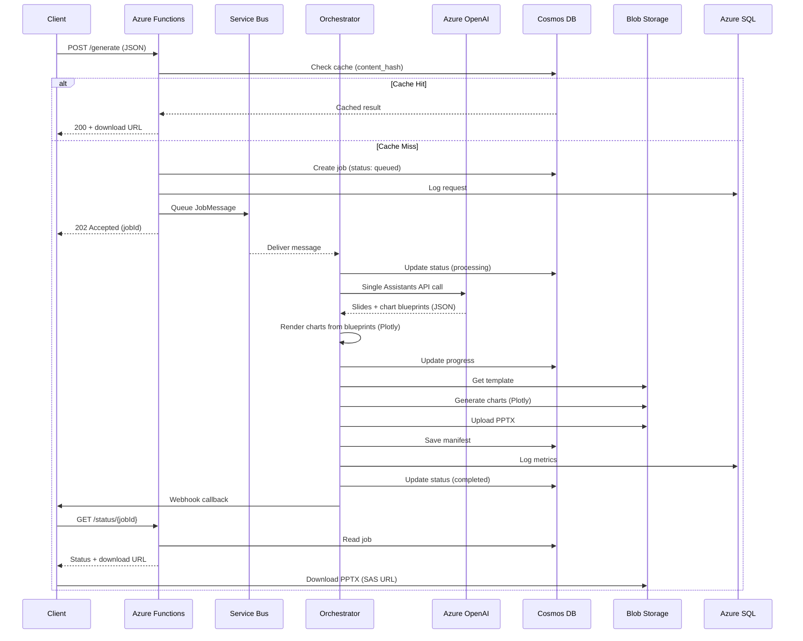

---

## 5. Azure Services Infrastructure

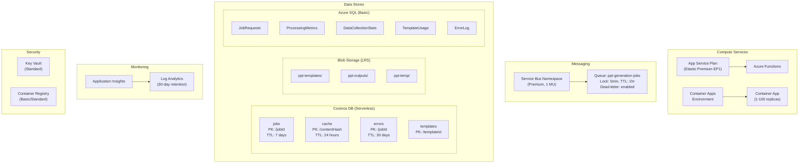

---

## 6. Data Storage Architecture

### Cosmos DB Collections

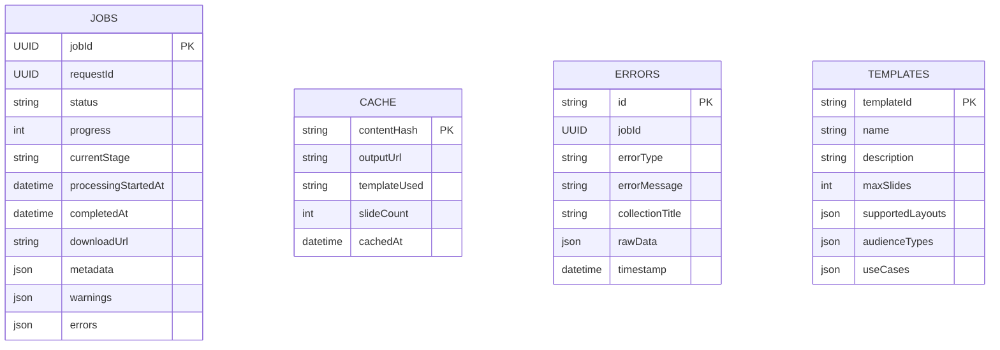

### SQL Telemetry Schema

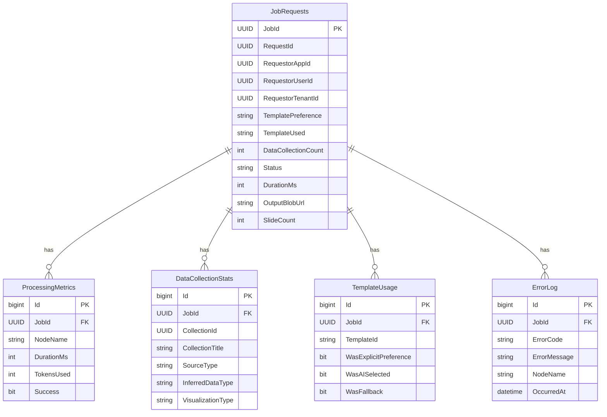

### Blob Storage Structure

```
ppt-templates/
├── it-strategy/
│   ├── template.pptx
│   └── metadata.json
├── budget/
│   ├── template.pptx
│   └── metadata.json
├── ciso-briefing/
│   └── ...
└── 2025-corporate-template/
    ├── template.pptx
    └── metadata.json

ppt-outputs/
├── {job-uuid-1}/
│   ├── presentation.pptx
│   ├── manifest.json
│   └── charts/
│       ├── chart-1.png
│       └── chart-2.png
└── {job-uuid-2}/
    └── ...

ppt-temp/
└── {job-uuid}/
    └── (working files, auto-cleaned)
```

### Template Metadata System

Each PowerPoint template folder contains a `metadata.json` file that provides crucial information for the generation pipeline:

**Purpose:**
- Maps slide layouts to content types
- Provides layout indices for dynamic slide assembly
- Filters usable layouts for content generation
- Guides AI-driven layout selection

**Structure:**
```json
{
  "templateId": "2025-corporate-template",
  "name": "Corporate 2025 Template",
  "description": "Corporate branded template with modern design",
  "version": "1.0.0",
  "createdDate": "2025-01-13",
  "layouts": [
    {
      "index": 0,
      "name": "Title Slide 2",
      "width": 10,
      "height": 7.5,
      "placeholders": [...],
      "category": "title_slide"
    },
    {
      "index": 3,
      "name": "Title Only",
      "category": "chart_or_graph",
      "notes": "Used for charts, graphs, tables, and full paragraphs"
    },
    ...
  ],
  "layoutSelectionGuide": {
    "title_slide": [0],
    "section_header": [11],
    "bulleted_text": [4],
    "chart_or_graph": [3],
    "text_with_graphic": [5],
    "paragraph_text": [3]
  },
  "contentLayouts": [0, 3, 4, 5, 11],
  "supportedContentTypes": [
    "TIME_SERIES",
    "CATEGORICAL",
    "COMPARISON",
    "PERCENTAGE",
    "RANKING",
    "FUNNEL",
    "FREE_FORM_TEXT"
  ]
}
```

**Key Fields:**

| Field | Description |
|-------|-------------|
| `layouts` | Complete list of all slide layouts with indices, names, dimensions, and placeholders |
| `layoutSelectionGuide` | Maps content types to layout indices for dynamic assembly |
| `contentLayouts` | Filtered list of layout indices used for content generation (excludes boilerplate) |
| `supportedContentTypes` | Data types this template can visualize effectively |

**Layout Selection Guide Categories:**

| Category | Purpose | Example Layouts |
|----------|---------|----------------|
| `title_slide` | Deck title page | Title Slide 2 (index 0) |
| `section_header` | Section dividers | Divider Slide (index 11) |
| `bulleted_text` | Text-based content | Title and Content (index 4) |
| `chart_or_graph` | Data visualizations | Title Only (index 3) |
| `text_with_graphic` | Hybrid text + image | Two column graphics right (index 5) |
| `paragraph_text` | Long-form narrative | Title Only (index 3) |

**Metadata Generation:**

The `metadata.json` file is automatically generated by the **Template Introspection Service** in the Function App:

1. **Function App** (`api-functions/src/services.py`):
   - `TemplateIntrospectionService` analyzes PPTX files
   - `_generate_layout_selection_guide()` creates content-type mappings
   - Filters layouts to exclude boilerplate slides (e.g., "End Slide", "Thank You")
   - Uploads `metadata.json` to blob storage alongside template

2. **Orchestrator** (`orchestrator/src/`):
   - `BlobStorageService.get_template_metadata()` retrieves metadata
   - `workflow_v3.py` passes metadata to assembler
   - `ppt_assembler.py` uses `layoutSelectionGuide` for dynamic layout selection

**Benefits:**
- **No Hardcoded Indices** - Layout positions adapt if template changes
- **Flexible Templates** - New templates work without code changes
- **AI-Guided Assembly** - Orchestrator selects optimal layouts per content type
- **Maintainability** - Template updates don't break generation logic

---

## 7. Template Metadata Flow

Template metadata flows from the Function App (at upload time) through Blob Storage to the Orchestrator (at generation time). This enables dynamic layout selection without hardcoded indices.

### Data Flow Overview

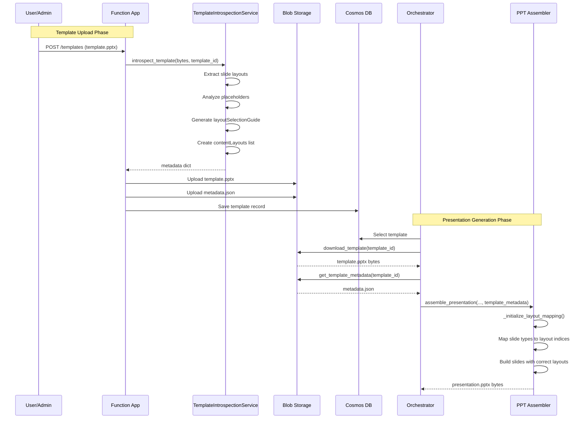

### Component Responsibilities

| Component | File | Responsibility |
|-----------|------|----------------|
| **TemplateIntrospectionService** | `api-functions/src/services.py` | Introspects PPTX, generates metadata |
| **BlobStorageService (Functions)** | `api-functions/src/services.py` | Uploads template + metadata |
| **BlobStorageService (Orchestrator)** | `orchestrator/src/services.py` | Downloads template + metadata |
| **workflow_v3.py** | `orchestrator/src/workflow_v3.py` | Passes metadata to assembler |
| **PPTAssembler** | `orchestrator/src/ppt_assembler.py` | Uses metadata for layout selection |

### metadata.json Schema

The complete schema for auto-generated template metadata:

```json
{
  "templateId": "2025-corporate-template",
  "version": "1.0.0",
  "name": "2025 Corporate PPT Template",
  "description": "Auto-generated metadata for template",
  "active": true,
  "useCases": [],
  "audienceTypes": ["general"],
  "bestFor": "General purpose presentations",
  "notRecommendedFor": [],

  "defaultBrandConfig": {
    "primaryColor": "#003366",
    "secondaryColor": "#E8F0F8",
    "baseColor": "#FFFFFF"
  },

  "dimensions": {
    "widthInches": 13.33,
    "heightInches": 7.5,
    "aspectRatio": "16:9"
  },

  "templateBlobPath": "2025-corporate-template/template.pptx",

  "layoutSelectionGuide": {
    "title_slide": {
      "layout": "Title Slide",
      "layoutIndex": 0,
      "when": "First slide of any presentation"
    },
    "section_header": {
      "layout": "Section Header",
      "layoutIndex": 2,
      "when": "Separating major sections"
    },
    "bulleted_text": {
      "layout": "Title and Content",
      "layoutIndex": 1,
      "when": "Bulleted lists, key points"
    },
    "chart_or_graph": {
      "layout": "Title Only",
      "layoutIndex": 5,
      "when": "Full-width charts, graphs, tables"
    },
    "text_with_graphic": {
      "layout": "Two Content",
      "layoutIndex": 3,
      "when": "Text alongside chart or image"
    },
    "paragraph_text": {
      "layout": "Title Only",
      "layoutIndex": 5,
      "when": "Paragraph text, flexible content"
    }
  },

  "contentLayouts": [
    {
      "layoutIndex": 0,
      "layoutName": "Title Slide",
      "layoutType": "title",
      "duplicatable": false,
      "placeholders": [
        {
          "idx": 0,
          "name": "Title 1",
          "type": "CENTER_TITLE",
          "contentType": "title",
          "accepts": ["text"]
        }
      ]
    },
    {
      "layoutIndex": 1,
      "layoutName": "Title and Content",
      "layoutType": "content",
      "duplicatable": true,
      "placeholders": [...]
    }
  ],

  "slideLayouts": [...],

  "slideExamples": [...],

  "templateInstructions": {
    "colorGuidelines": [],
    "formattingRules": [],
    "layoutGuidelines": [],
    "graphGuidelines": []
  },

  "metadata": {
    "createdAt": "2025-01-13T00:00:00.000Z",
    "updatedAt": "2025-01-13T00:00:00.000Z",
    "createdBy": "template-introspection-service",
    "introspectedAt": "2025-01-13T00:00:00.000Z",
    "tags": ["auto-generated"]
  }
}
```

### layoutSelectionGuide Keys

The `layoutSelectionGuide` maps content categories to specific layout indices:

| Guide Key | Description | Used For Slide Types |
|-----------|-------------|----------------------|
| `title_slide` | Opening presentation slide | `title` |
| `section_header` | Section divider slides | `section_header`, `section` |
| `bulleted_text` | Text content with bullet points | `content`, `text`, `executive_summary`, `conclusion` |
| `chart_or_graph` | Full-width data visualizations | `data`, `title_only` |
| `text_with_graphic` | Two-column text + image layouts | `two_column`, `hybrid` |
| `paragraph_text` | Long-form paragraph content | `paragraph` |

### Slide Type Mapping

The PPT Assembler maps slide types from the Assistant response to layout guide keys:

```python
# PPT Assembler: _initialize_layout_mapping()
slide_type_to_guide_key = {
    "title": "title_slide",           # Opening slide
    "section": "section_header",      # Section dividers
    "title_only": "chart_or_graph",   # Full-width charts
    "content": "bulleted_text",       # Bullet content
    "two_column": "text_with_graphic",# Text + graphic
    "paragraph": "paragraph_text",    # Long-form text
}
```

### Supported Slide Types

| Slide Type | Layout Used | Description |
|------------|-------------|-------------|
| `title` | Title Slide (idx 0) | Opening title slide |
| `data` | Title Only (chart_or_graph) | Full-width chart/visualization |
| `executive_summary` | Title and Content (bulleted_text) | Summary with bullet points |
| `section_header` | Section Header (idx 2) | Section divider |
| `conclusion` | Title and Content (bulleted_text) | Closing bullet points |
| `two_column` | Two Content (text_with_graphic) | Text + graphic side-by-side |
| `paragraph` | Title Only (paragraph_text) | Long-form paragraph content |
| `content` | Title and Content (bulleted_text) | Generic bullet content |

### New Slide Types (v2.2)

Two new slide types were added to support richer content layouts:

#### `two_column` Slide Type

Uses the `text_with_graphic` layout for side-by-side content:

```json
{
  "slide_type": "two_column",
  "slide_number": 5,
  "title": "Key Findings",
  "bullets": [
    "Finding 1",
    "Finding 2",
    "Finding 3"
  ],
  "chart_file": "chart_5.png"
}
```

- Left side: Bullet points from `bullets` array
- Right side: Chart image from `chart_file`
- Uses layout index from `text_with_graphic` in metadata

#### `paragraph` Slide Type

Uses the `paragraph_text` layout for long-form narrative:

```json
{
  "slide_type": "paragraph",
  "slide_number": 6,
  "title": "Executive Summary",
  "content": "Long paragraph text that describes the situation in detail...",
  "key_insight": "Optional key takeaway"
}
```

- Full-width text box below title
- Falls back to bullets if `content` not provided
- Uses layout index from `paragraph_text` in metadata

### Dynamic Layout Resolution

The PPT Assembler resolves layouts dynamically at runtime:

```
1. Check if template_metadata is provided
   ├── YES: Extract layoutSelectionGuide
   │   ├── For each slide_type, lookup guide_key
   │   ├── Get layoutIndex from guide
   │   └── Cache in _layout_cache
   └── NO: Use hardcoded fallback indices

2. For each slide being added:
   ├── Get slide_type from slide definition
   ├── Lookup index in _layout_cache
   ├── Validate index < len(slide_layouts)
   └── Return prs.slide_layouts[index]
```

### Fallback Behavior

When metadata is missing or incomplete:

| Condition | Behavior |
|-----------|----------|
| No metadata | Use hardcoded defaults (title=0, content=1, etc.) |
| Missing guide key | Use closest default layout index |
| Index out of range | Fall back to index 1 (Title and Content) |
| Layout not found | Log warning, use safe default |

### Files Modified for Template Metadata Flow

| File | Changes |
|------|---------|
| `api-functions/src/services.py` | Added `TemplateIntrospectionService` with `_generate_layout_selection_guide()` |
| `orchestrator/src/services.py` | Added `BlobStorageService.get_template_metadata()` method |
| `orchestrator/src/workflow_v3.py` | Fetches metadata via `blob_service.get_template_metadata()`, passes to assembler |
| `orchestrator/src/ppt_assembler.py` | Added `_initialize_layout_mapping()`, `_add_two_column_slide()`, `_add_paragraph_slide()` |

---

## 8. Service Dependencies

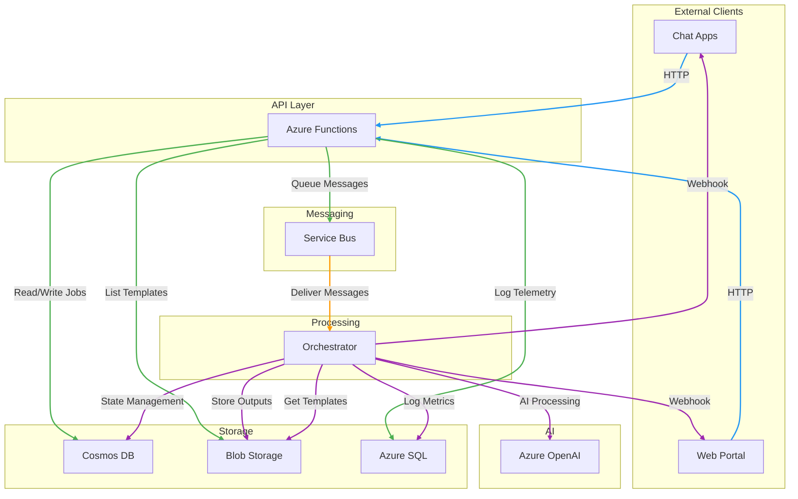

### Dependency Matrix

| Service | Depends On | Depended By |
|---------|------------|-------------|
| **Azure Functions** | Cosmos DB, Service Bus, SQL, Blob | Clients, APIM |
| **Service Bus** | - | Functions, Orchestrator |
| **Orchestrator** | Service Bus, Cosmos DB, Blob, SQL, OpenAI | - |
| **Cosmos DB** | - | Functions, Orchestrator |
| **Blob Storage** | - | Functions, Orchestrator |
| **Azure SQL** | - | Functions, Orchestrator |
| **Azure OpenAI** | - | Orchestrator |
| **Key Vault** | - | Functions, Orchestrator |

---

## 9. Scaling & Autoscaling

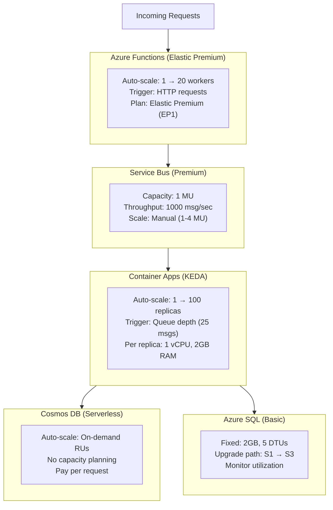

### Scaling Configuration

| Component | Min | Max | Trigger | Scale Time |
|-----------|-----|-----|---------|------------|
| Azure Functions | 1 worker | 20 workers | HTTP requests | ~seconds |
| Container Apps | 1 replica | 100 replicas | Queue depth (25 msgs) | ~30 seconds |
| Service Bus | 1 MU | 4 MU | Manual | ~minutes |
| Cosmos DB | Auto | Auto | Request Units | Instant |

---

## 10. Error Handling & Retry Logic

The V3 architecture uses a simplified error handling approach with Service Bus-level retries and error logging.

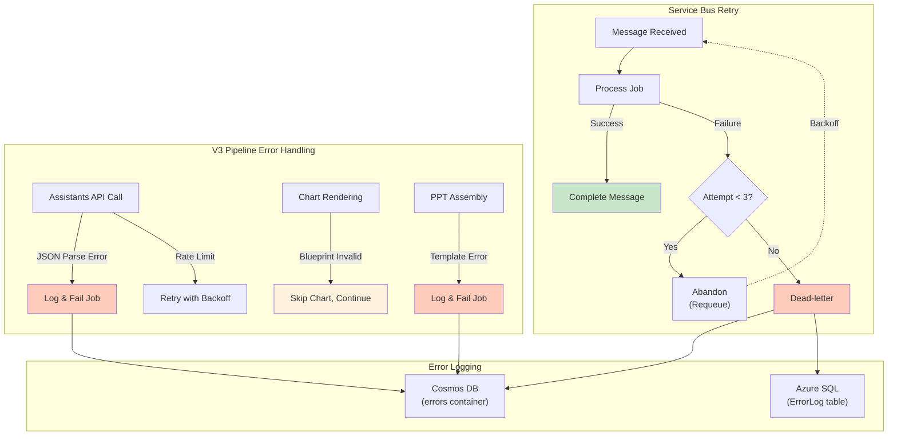

### Error Codes

| Code | Description | Retryable |
|------|-------------|-----------|
| `PARSE_ERROR` | Invalid JSON in request or response | No |
| `TEMPLATE_NOT_FOUND` | No matching template in Cosmos/Blob | No |
| `OPENAI_RATE_LIMIT` | API quota exceeded | Yes (3x with exponential backoff) |
| `OPENAI_TIMEOUT` | API response timeout | Yes (2x) |
| `BLUEPRINT_INVALID` | Chart blueprint failed validation | No (chart skipped, job continues) |
| `BLOB_UPLOAD_FAILED` | Storage write error | Yes (2x) |
| `PROCESSING_ERROR` | General pipeline error | No |

---

## 11. Security Architecture

### Overview

**CRITICAL: All service-to-service authentication uses Managed Identity. No connection strings or access keys are used.**

This is a Microsoft internal requirement and is enforced throughout the architecture.

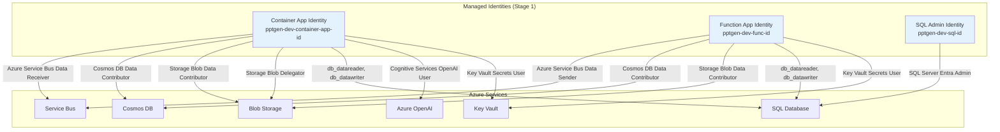

### Authentication Patterns

#### Managed Identity Only

All Azure services are configured to use **Managed Identity** for authentication:

| Service | Authentication Method | Configuration |
|---------|----------------------|---------------|
| **Service Bus** | Managed Identity | `DefaultAzureCredential` with RBAC roles |
| **Cosmos DB** | Managed Identity | `DefaultAzureCredential` with RBAC roles |
| **Blob Storage** | Managed Identity | `DefaultAzureCredential` with RBAC roles, shared key access disabled |
| **SQL Database** | Entra ID (Managed Identity) | Connection string with `Authentication=Active Directory Managed Identity` |
| **Azure OpenAI** | Managed Identity | `DefaultAzureCredential` with scope `https://cognitiveservices.azure.com/.default` |
| **Key Vault** | Managed Identity | `DefaultAzureCredential` with RBAC roles |

#### Storage Account Configuration

**CRITICAL:** Storage accounts have shared key access disabled:

```bicep
properties: {
  allowSharedKeyAccess: false  // Forces managed identity
  publicNetworkAccess: 'Enabled'  // Required for MI access
}
```

Even though `publicNetworkAccess` is enabled, access is only granted to identities with RBAC roles. No connection strings are used.

#### Function App Storage Authentication

Azure Functions require special configuration to use managed identity for internal storage:

```bash
# Internal Function Runtime Storage
AzureWebJobsStorage__blobServiceUri=https://pptgendevfuncqskh.blob.core.windows.net
AzureWebJobsStorage__queueServiceUri=https://pptgendevfuncqskh.queue.core.windows.net
AzureWebJobsStorage__tableServiceUri=https://pptgendevfuncqskh.table.core.windows.net
AzureWebJobsStorage__credential=managedidentity
AzureWebJobsSecretStorageType=files

# External Blob Storage (Stage 2)
BlobStorage__blobServiceUri=https://pptgendevqskhmc2dhedgg.blob.core.windows.net
BlobStorage__credential=managedidentity
```

### RBAC Role Assignments

All role assignments are defined in the Bicep templates and applied during deployment.

#### Container App Identity (`pptgen-dev-container-app-id`)

| Resource | Role | Purpose |
|----------|------|---------|
| Service Bus Namespace | Azure Service Bus Data Receiver | Consume job messages from queue |
| Cosmos DB Account | Cosmos DB Data Contributor | Read/write jobs, cache, templates, errors |
| Storage Account (Stage 2) | Storage Blob Data Contributor | Read templates, write outputs |
| Storage Account (Stage 2) | Storage Blob Delegator | Generate SAS tokens for download URLs |
| Azure OpenAI Account | Cognitive Services OpenAI User | Call GPT-4o and GPT-4o-mini models |
| SQL Database | db_datareader, db_datawriter (Entra) | Write telemetry data |
| Key Vault | Key Vault Secrets User | Read secrets (if SQL password mode used) |

#### Function App Identity (`pptgen-dev-func-id`)

| Resource | Role | Purpose |
|----------|------|---------|
| Service Bus Namespace | Azure Service Bus Data Sender | Queue job messages |
| Cosmos DB Account | Cosmos DB Data Contributor | Manage jobs, cache, templates |
| Storage Account (Stage 2) | Storage Blob Data Contributor | List templates, read metadata |
| Storage Account (Stage 4) | Storage Blob Data Owner | Function runtime storage (internal) |
| Storage Account (Stage 4) | Storage Queue Data Contributor | Function runtime queues |
| Storage Account (Stage 4) | Storage Table Data Contributor | Function runtime tables |
| Storage Account (Stage 4) | Storage Account Contributor | Full management access |
| SQL Database | db_datareader, db_datawriter (Entra) | Write telemetry data |
| Key Vault | Key Vault Secrets User | Read secrets (if needed) |

#### SQL Admin Identity (`pptgen-dev-sql-id`)

| Resource | Role | Purpose |
|----------|------|---------|
| SQL Server | SQL Server Entra Admin | Administrative access for Entra-only auth mode |

### SQL Database Access

SQL Database is configured for **Entra-only authentication** (no SQL username/password):

```sql
-- Grant Container App identity access
CREATE USER [pptgen-dev-container-app-id] FROM EXTERNAL PROVIDER;
ALTER ROLE db_datareader ADD MEMBER [pptgen-dev-container-app-id];
ALTER ROLE db_datawriter ADD MEMBER [pptgen-dev-container-app-id];

-- Grant Function App identity access
CREATE USER [pptgen-dev-func-id] FROM EXTERNAL PROVIDER;
ALTER ROLE db_datareader ADD MEMBER [pptgen-dev-func-id];
ALTER ROLE db_datawriter ADD MEMBER [pptgen-dev-func-id];
```

**Connection string pattern (no password):**
```
Server=pptgen-dev-sql.database.windows.net;Database=telemetry;Authentication=Active Directory Managed Identity;
```

### Network Security

**Current Configuration (POC):**
- All services use public endpoints
- Access controlled via Managed Identity RBAC
- No Virtual Network integration

**Production Recommendations:**

| Service | Recommendation |
|---------|---------------|
| Storage Account | Private Endpoint, disable public access |
| Cosmos DB | Private Endpoint, firewall rules |
| SQL Server | Private Endpoint, firewall rules |
| Service Bus | Private Endpoint |
| Azure OpenAI | Private Endpoint |
| Key Vault | Private Endpoint |
| Container Apps | VNet integration |
| Functions | VNet integration |

### Key Vault

**Configuration:**
- **Access Model**: Azure RBAC (not access policies)
- **Soft Delete**: Enabled (90-day retention)
- **Purge Protection**: Disabled (can be enabled for production)
- **Public Network Access**: Enabled (required for Function App access)

**Secrets stored (if SQL authentication mode used):**
- `sql-admin-password` - SQL admin password (only if not using Entra-only auth)

**RBAC roles:**
- Container App MI: Key Vault Secrets User
- Function App MI: Key Vault Secrets User
- Deployer identity: Key Vault Administrator

### TLS & Encryption

| Service | TLS Version | Encryption at Rest | Encryption in Transit |
|---------|-------------|-------------------|---------------------|
| Storage Account | TLS 1.2+ | Enabled (Microsoft-managed) | HTTPS only |
| Cosmos DB | TLS 1.2+ | Enabled (Microsoft-managed) | HTTPS only |
| SQL Database | TLS 1.2+ | Transparent Data Encryption (TDE) | HTTPS only |
| Service Bus | TLS 1.2+ | Enabled (Microsoft-managed) | HTTPS only |
| Azure OpenAI | TLS 1.2+ | Enabled (Microsoft-managed) | HTTPS only |
| Key Vault | TLS 1.2+ | HSM-backed | HTTPS only |
| Container Apps | TLS 1.2+ | N/A (stateless) | HTTPS only |
| Functions | TLS 1.2+ | N/A (stateless) | HTTPS only |

### Security Best Practices Implemented

1. **No Secrets in Code**: All authentication via Managed Identity
2. **Least Privilege**: Each identity has only required permissions
3. **Entra-only Auth**: SQL Server uses Entra ID (no SQL passwords)
4. **Disabled Shared Keys**: Storage accounts do not allow access key auth
5. **HTTPS Only**: All services enforce HTTPS
6. **TLS 1.2+**: Minimum TLS version enforced
7. **Soft Delete**: Key Vault and OpenAI have soft-delete enabled
8. **RBAC Everywhere**: All services use Azure RBAC for authorization
9. **No Public Blob Access**: Blob containers are private
10. **Application Insights**: All apps instrumented for security monitoring

### Compliance & Governance

**Required Tags:**
- `Environment` (dev, stg, prd)
- `Stage` (1-6)
- `Purpose` (Foundation, Data, Compute, Functions, AI, Web)
- `Application` (PPT-Generator)
- `ManagedBy` (Bicep)

**Audit & Monitoring:**
- All resource changes logged to Activity Log
- Diagnostic settings enabled for all services
- Logs sent to Log Analytics workspace
- Application Insights for application-level monitoring

---

## Technology Stack Summary

| Layer | Technology | Version |
|-------|------------|---------|
| **API** | Azure Functions | Python 3.11 |
| **Orchestrator** | Azure OpenAI Assistants API + FastAPI | Python 3.11 |
| **AI** | Azure OpenAI | GPT-4o, GPT-4o-mini |
| **Charts** | Plotly + Kaleido | Latest |
| **PPTX** | python-pptx | 0.6.23+ |
| **Messaging** | Azure Service Bus | Premium |
| **State** | Cosmos DB | Serverless |
| **Storage** | Azure Blob Storage | Standard LRS |
| **Telemetry** | Azure SQL Database | Basic |
| **Monitoring** | Application Insights | Workspace-based |
| **Web Portal** | ASP.NET Core | 8.0 |
| **IaC** | Bicep / Terraform | Latest |

---

## Related Documentation

- **Configuration Guide**: `/docs/CONFIGURATION.md` - Detailed service configurations and environment variables
- **Deployment Guide**: `/docs/DEPLOYMENT.md` - Step-by-step deployment instructions
- **Development Guide**: `/docs/DEVELOPMENT.md` - Developer onboarding and local setup
- **AZURE_CONFIG.json**: `/AZURE_CONFIG.json` - Central configuration file (auto-generated during deployment)

---

*Last updated: January 29, 2025*

## Revision History

| Date | Version | Changes |
|------|---------|---------|
| 2025-01-29 | 4.0 | **CONSOLIDATED FOR CUSTOMER HANDOFF**: Merged ARCHITECTURE.md and ARCHITECTURE_V3_ASSISTANTS.md; removed unimplemented Code Interpreter approach; enhanced design philosophy section; confirmed blueprint-based chart rendering implementation |
| 2025-01-20 | 3.1 | **ACCURACY REVIEW**: Fixed TOC anchor for Section 3; updated Supported Visualization Types to 9 types (HORIZONTAL_BAR, GROUPED_BAR, STACKED_BAR, PIE, DONUT, LINE, AREA, WATERFALL, DIVERGING_BAR); removed references to non-existent FUNNEL, SANKEY, RADAR chart types; updated Prescriptive Mapping Table; replaced Node 5b/Visualization Validator with V3 blueprint validation; updated Error Handling section to reflect V3 simplified retry logic; updated error codes table |
| 2025-01-19 | 3.0 | **MAJOR CORRECTION**: Updated entire document to reflect actual V3 architecture - removed all references to LangGraph and 9-node pipeline; documented single Assistants API call approach with local chart rendering; updated diagrams, technology stack, and design evolution section |
| 2025-01-13 | 2.3 | Added Section 7 (Template Metadata Flow) documenting the complete data flow from Function App template upload through Blob Storage to Orchestrator/PPT Assembler; documented new `two_column` and `paragraph` slide types; added sequence diagram and component responsibilities table |
| 2025-01-13 | 2.2 | Added Template Metadata System documentation describing metadata.json structure, layoutSelectionGuide, contentLayouts, and automatic metadata generation via Template Introspection Service |
| 2025-01-13 | 2.1 | Added comprehensive FREE_FORM_TEXT handling section documenting detection criteria, multi-slide generation, bullet extraction logic, layout options, and example payloads |
